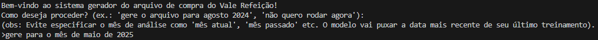
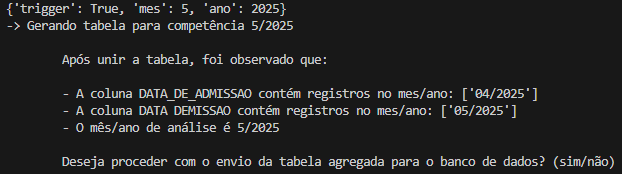
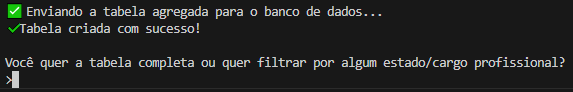
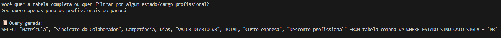
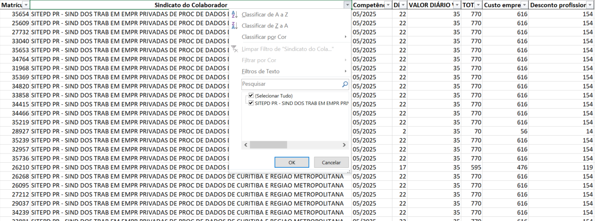

# 🤖 Projeto: Execução de Agente com LangChain + Claude

Este projeto utiliza Python 3.11.3 para executar um agente que gera uma tabela de compra de vale refeição de maneira automática.  
Você pode executar tudo localmente a partir de qualquer prompt de comando (Windows, macOS ou Linux), incluindo o terminal do VS Code.
Esse é um exercício parte do curso de agentes inteligentes do Instituto I2A2.

---

## ✅ Pré-requisitos

1. **Python 3.11.3**
   - Baixe e instale a versão exata:  
     👉 https://www.python.org/downloads/release/python-3113/
   - Durante a instalação:
     - Marque a opção **"Add Python to PATH"**.
     - Clique em **"Customize installation"** se quiser garantir que `pip` e o `venv` estejam marcados.

2. **Editor (opcional, mas recomendado): [Visual Studio Code](https://code.visualstudio.com/)**

---

## 🧪 Como rodar o projeto (passo a passo)

### 1. **Abrir o terminal**

- **No VS Code**:
  - Vá em `Terminal > New Terminal` ou use o atalho: `Ctrl + ` (crase)
- **No Windows**:
  - Pressione `Win + R`, digite `cmd` e pressione Enter.
- **No macOS/Linux**:
  - Use o app "Terminal" normalmente.

---

### 2. **Criar um ambiente virtual**

```bash
python -m venv .venv
```

> Isso criará um ambiente isolado na pasta `.venv`.

---

### 3. **Ativar o ambiente virtual**

- **Windows (cmd)**:
  ```bash
  .venv\Scripts\activate
  ```

- **PowerShell (Windows)**:
  ```bash
  .venv\Scripts\Activate.ps1
  ```

- **macOS/Linux**:
  ```bash
  source .venv/bin/activate
  ```

Você verá o prefixo `(.venv)` no terminal quando estiver ativo.

---

### 4. **Instalar as dependências**

Certifique-se de que o terminal está na pasta do projeto (onde está o arquivo `requirements.txt`), e então execute:

```bash
pip install -r requirements.txt
```

---

### 5. **Inserir sua chave da API da Claude (Anthropic)**

- Faça uma cópia do arquivo `.env-example` e renomeie para `.env`:

```bash
cp .env-example .env  # macOS/Linux
# ou
copy .env-example .env  # Windows cmd
```

- Edite o arquivo `.env` e insira sua chave da API:

```env
ANTHROPIC_API_KEY=sua_chave_aqui
```

> ⚠️ Sua chave pode ser obtida no site da [Anthropic](https://console.anthropic.com/).  
> Sem essa chave, o agente não conseguirá se comunicar com o modelo Claude.

---

### 6. **Executar o agente**

Com tudo pronto, basta rodar o script:

```bash
python run_agent.py
```

---

## 💡 Funcionamento do sistema de agentes

1) O sistema irá perguntar se o usuário quer gerar a tabela de compra de vr e se quiser gerar, que especifique o mês cálculo. 
Com essas especificações, será acionado um script em pandas que já faz os cálulos para a obtenção da tabela final, com base nos arquivos da pasta /data (precisa inserir os arquivos). 



2) Isso irá gerar o seguinte output, caso seja especificado o mês/ano:



A mensagem é disposta dessa forma pois as colunas DATA_DE_ADMISSAO e DATA DEMISSAO deveriam ser do mesmo mês de análise, no caso do exemplo, mês 5.
Caso o usuário decida prosseguir (mesmo ciente da discrepância), a tabela final será então encaminhada para o banco de dados duckdb para a solicitação final do usuário. 

3) Isso irá gerar o seguinte output, caso o usuário confirme: 



Como uma etapa final, o usário pode especificar se quer algum filtro de cargo/estado específico da tabela final, como por exemplo:



Assim será gerada uma query e em seguida a tabela final em si será aberta no formato .xlsx: 




---

## 📂 Estrutura esperada do projeto

```
seu-projeto/
│
├── run_agent.py
├── requirements.txt
├── .env-example
├── .env  ← (criado por você)
├── .venv/  ← (criado por você)
└── ...
```

---

## 🤝 Suporte

Se tiver dúvidas, sinta-se à vontade para abrir uma *issue* ou procurar tutoriais sobre ambiente virtual e instalação de Python no YouTube.

---